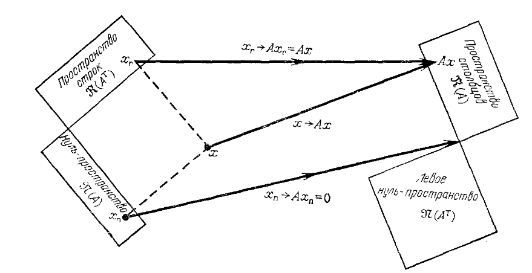
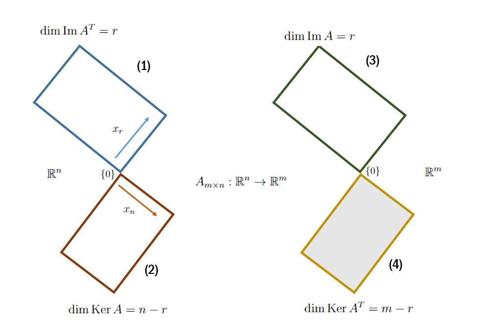

## Pylineq: мотивация
Модуль ```pylineq``` решает системы линейных уравнений (СЛУ) в случае бесконечного количества решений (недоопределённый случай).
Библиотеки ```numpy``` и ```scipy``` не предоставляют такой возможности. Помимо этого:
- Генерирование TeX-кода СЛУ и её решения в двух формах: обычной и векторной. 
- Задача, когда в системе необходимо найти такие переменные, которые не зависят от констант $C_i$.

## Примеры использования / Quickstart
$$
\begin{equation}\left\{\begin{aligned}
x_1 + 2x_2 + x_3 + x_4 &= 7 \\
x_1 + 2x_2 + 2x_3 - x_4 &= 12 \\
2x_1 + 4x_2 + 6x_4 &= 4 \\
\end{aligned}\right.\end{equation}
$$
```python
from sympy import Matrix

A = Matrix([[1, 2, 1, 1],
            [1, 2, 2, -1],
            [2, 4, 0, 6]])
b = Matrix([7, 12, 4])
sle = LinEqSystem.make(A, b)
sle.solve()
sle.tex_condition()
sle.tex_solution()
sle.tex_solution_vectorform() 
sle.classify() # Классификация системы по количеству решений - одно, бесконечно много, нет решений (несовместная).
sle.nullspace() # Ker A
sle.columnspace() # Im A, 
sle.free_vars() # Свободные переменные
```
$$
\begin{equation}\left\{\begin{aligned}
x_1 &= -2C_1 - 3C_2 + 2. \\
x_2 &= C_1  \\
x_3 &= 2C_2 + 5. \\
x_4 &= C_2  \\
\end{aligned}\right.\end{equation}
$$

$$
\begin{pmatrix}
x_1\\
x_2\\
x_3\\
x_4
\end{pmatrix} = C_1 
\begin{pmatrix}
-2\\
1\\
0\\
0\\
\end{pmatrix} +C_2 
\begin{pmatrix}
-3\\
0\\
2\\
1\\
\end{pmatrix} +
\begin{pmatrix}
2\\
0\\
5\\
0\\
\end{pmatrix} 
$$

## Pylineq: теоретическое введение
К репозиторию прилагается статья, где рассматривается концепция <a href="https://www.youtube.com/watch?v=ggWYkes-n6E&ab_channel=MITOpenCourseWare"> 'big picture of linear algebra'</a>:

<figure>
    
    <figcaption><i>Рис. 1. Устройство любой СЛУ</i></figcaption>
</figure>

Благодаря такой визуализации легко доказывается **теорема и альтернатива Фредгольма**. 
<figure>
    
    <figcaption><i>Рис. 2. Big picture of linear algebra в терминах образа и ядра</i></figcaption>
</figure>
